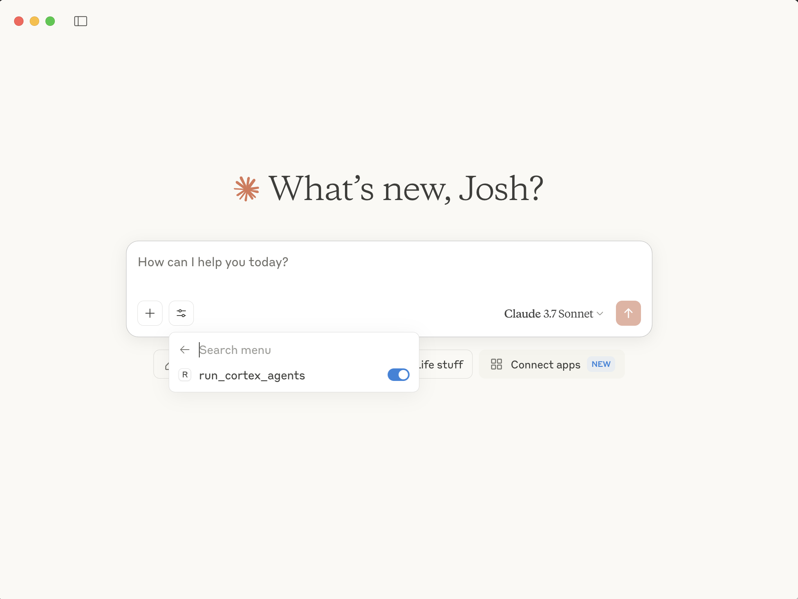

# Build an MCP Server for Cortex Agents

This guide walks through how to build your own MCP Server for Cortex Agents.

The core functionalities include:

- Allow agents to interact with Cortex Agents as a tool
- Test the connection with Claude Desktop

In this tutorial, we’ll build a simple MCP **Cortex Agent** server and connect it to an MCP host (Claude for Desktop). We’ll start with a basic setup, then progress to more complex use cases.

See it in action!


## What we’ll be building

Many LLMs don’t natively orchestrate external “agent” workflows. With MCP, we can expose Cortex Agents capabilities as first-class tools in your chat client.

We’ll build a server that exposes one tool:

- `cortex_agent_run`: submit a query to Cortex Agents and get its output  

Then we’ll connect the server to an MCP host (Claude for Desktop):

> **Note:** you can connect any MCP-compatible client, but this guide uses Claude for Desktop for simplicity. See the official MCP [client SDK guide](#) for building your own, or browse [other clients](https://modelcontextprotocol.io/clients).

## Prerequisites

- Cortex Analyst semantic model and Cortex Search service created, such as via this ([quickstart](https://quickstarts.snowflake.com/guide/getting_started_with_cortex_agents/index.html#0))
- A [Programattic Access Token](https://docs.snowflake.com/en/user-guide/programmatic-access-tokens) created

## System requirements

- Python **3.10+**  
- Python MCP SDK **1.2.0+**  

---

## 1. Set up your environment

First install the MCP CLI (`uv`) and bootstrap your project:

### macOS / Linux

```bash
curl -LsSf https://astral.sh/uv/install.sh | sh
# restart your terminal to pick up `uv`
```

### Windows

```bash
irm https://astral.sh/uv/install.ps1 | iex
# restart your shell
```

Configure and create your Cortex Agents project:

```bash
# Clone the repo
git clone https://github.com/Snowflake-Labs/sfguide-mcp-cortex-agent.git
cd sguide-mcp-cortex-agent

# Create and activate venv
uv venv
source .venv/bin/activate   # macOS/Linux
# .venv\Scripts\Activate.ps1 # Windows PowerShell

# Install MCP SDK and HTTP client
uv add "mcp[cli]" httpx
```

Set the keys and services needed to run Cortex Agents by creating a `.env` following the `.env.template` with:

* SNOWFLAKE_ACCOUNT_URL
* SNOWFLAKE_PAT
* SEMANTIC_MODEL_FILE
* CORTEX_SEARCH_SERVICE

## 2. Run the server

Run:

```bash
uv run cortex_agents.py
```

> **Note:** Leave this (the MCP server) running while you call it from the MCP client.

## 3. (Optional) Use the Cortex Agents MCP Server in Claude Desktop

Install or update Claude for Desktop.

Open your config file:

macOS: ~/Library/Application Support/Claude/claude_desktop_config.json

Windows: %APPDATA%\Claude\claude_desktop_config.json

Add your Cortex Agents server:

```json
{
  "mcpServers": {
    "cortex-agent": {x
      "command": "uv",
      "args": [
        "--directory",
        "/ABSOLUTE/PATH/TO/PARENT/FOLDER/sfguide-mcp-cortex-agents",
        "run",
        "cortex_agents.py"
      ]
    }
  }
}
```

> **Note:** You may need to replace "uv" with the full uv path. You can find the uv path by running `which uv`.

Launch the Claude for Desktop app.

Now our Cortex Agents MCP server is available for use by Claude. We can see it by clicking on the tools icon, and toggle it on and off.



Then, run a query. If the query calls your MCP server, you will see the name of the tool used directly below your query in the Claude desktop app.

Because we're connected to Cortex Agents, we can ask questions about both unstructured data (via Cortex Search) and structured data via Cortex Analyst.

Unstructured data:


Structured data:


## 4. Customize your Cortex Agents

In `cortex_agents.py`, update the `payload` included in the function `run_cortex_agents` to include more tools or different configurations (such as LLMs).
